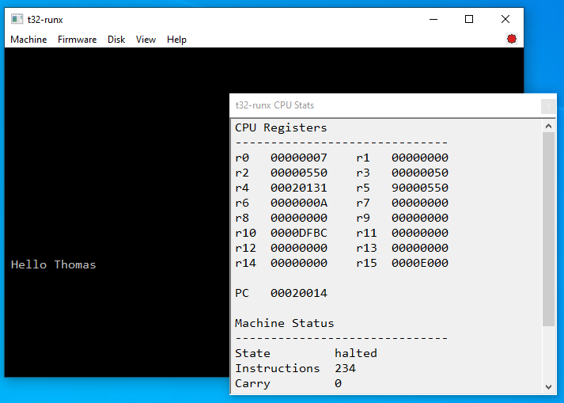

# T32

*A small, understandable 32-bit computer architecture and software
platform built from the instruction set upward.*



## What is T32?

**T32** is an open-source project for building and understanding a
complete computer platform one layer at a time.

The project begins with a deliberately small 32-bit instruction set and
grows upward through the assembler, linker, C compiler, runtime library,
virtual machine, firmware, storage, boot process, system services, and
eventually an operating environment.

T32 is not intended merely to be another emulator. Its purpose is to
make the relationships between the layers of a computer visible,
testable, and understandable. The project favors clarity over
cleverness, explicit contracts over hidden behavior, and executable
validation wherever practical.

A T32 program can now be written in C, compiled with the T32 toolchain,
linked against the T32 runtime, placed on a T32 disk image, booted
through T32 firmware, and executed by the T32 virtual machine.

------------------------------------------------------------------------

## Where We Are

T32 has progressed from an ISA experiment into a small bootable computer
platform.

``` text
T32 virtual machine
        |
       BIOS
        |
    BOOT.BIN
        |
 NEXT.BIN / Stage3
        |
 interactive C monitor
```

The complete **BIOS -\> BOOT.BIN -\> NEXT.BIN** chain is validated.
Current platform milestones include BIOS 0.0.6, BOOT 0.0.4, Bootinfo
v0.2, BIOS disk service v0.1, compiler-built Stage3, `libt32`, T32D boot
media, keyboard, an 80x25 text display, and a guest-visible RTC.

Current capabilities include:

-   32-bit T32 Instruction Set Architecture
-   ISA, ABI, algorithm, firmware, runtime, and integration validation
-   assembler (`t32-as`)
-   linker (`t32-ld`)
-   archive manager (`t32-ar`)
-   symbol inspector (`t32-nm`)
-   developing C compiler (`t32-cc`)
-   ABI and calling convention
-   startup code and static target runtime (`libt32`)
-   command-line VM (`t32-run`)
-   Windows graphical developer VM (`t32-runx`)
-   memory-mapped 80x25 text display
-   keyboard input
-   virtual block storage
-   T32D disk images and `t32-disk`
-   BIOS and multi-stage disk boot
-   Bootinfo handoff and BIOS disk services
-   real-time clock
-   compiler-built interactive Stage3 monitor

The Stage3 monitor currently provides commands including:

``` text
help
version
bootinfo
mem
time
halt
```

T32 is still intentionally small, but its pieces now cooperate as a
computer system rather than as isolated demonstrations.

------------------------------------------------------------------------

## A Small C Example

T32 C code is becoming increasingly ordinary:

``` c
extern int puts(char *s);

int main(void)
{
    char *message = "Hello Thomas";

    puts(message);
    return 0;
}
```

The screenshot at the top of this README shows C-built code executing in
`t32-runx`, with the T32 CPU state available for inspection.

------------------------------------------------------------------------

## Tools

  Tool         Purpose
  ------------ ------------------------------------------------
  `t32-as`     T32 assembler
  `t32-ld`     T32 linker
  `t32-ar`     static archive manager
  `t32-nm`     object and symbol inspector
  `t32-cc`     developing T32 C compiler
  `t32-disk`   create, inspect, and populate T32D disk images
  `t32-run`    command-line T32 virtual machine
  `t32-runx`   Windows graphical T32 developer VM

The target environment also includes `crt0`, `libt32`, BIOS firmware,
BOOT.BIN, and Stage3.

### t32-run

`t32-run` is the command-line reference/developer VM. It is designed for
scripted execution, automated validation, register and memory
inspection, firmware work, and repeatable machine tests.

### t32-runx

`t32-runx` is the Windows graphical T32 developer VM. It provides the
T32 display in a native window and supports interactive keyboard use,
disk attachment, firmware controls, machine start/stop/reset, and
CPU-state inspection.

`t32-runx` includes an embedded default BIOS for convenient normal
startup while retaining external BIOS selection for firmware
development.

Both `t32-run` and `t32-runx` are intentionally **single-vCPU**
machines. Multi-vCPU and larger VM lifecycle concerns belong to the
later `t32-node` and Foundry architecture.

------------------------------------------------------------------------

## Storage and Boot

T32 currently uses **T32D**, an intentionally simple native disk format
for bootstrapping and firmware development.

``` text
T32D disk image
    |
    +-- BOOT.BIN
    |
    +-- NEXT.BIN
```

The BIOS recognizes T32 media and transfers control to BOOT.BIN.
BOOT.BIN uses the firmware disk service to locate and load the next
stage.

T32D is deliberately not the final filesystem design. A later firmware
generation is expected to understand conventional partitioning and a
real filesystem such as **ext2**. One planned convention is:

``` text
GPT disk
    |
    +-- T32 boot/system partition
            |
            +-- ext2
                    |
                    +-- /EFI/T32/BOOT.BIN
```

The important contract is that the in-memory boot interface can remain
stable even as the way firmware finds BOOT.BIN becomes more capable.

------------------------------------------------------------------------

## The C Compiler

`t32-cc` is being grown incrementally, with each language feature
validated before another layer is added.

The compiler has progressed through arithmetic, precedence, comparisons,
structured control flow, loops, multiple locals, functions, parameters,
nested calls, external functions, string literals, pointers, `char`,
typed pointer arithmetic, fixed-size local arrays, named structures,
member access, and structure pointers using `->`.

Important future compiler/runtime work includes broader C type support,
additional aggregate behavior, conventional target headers, and
eventually variadic functions.

The target environment should ultimately allow normal source such as:

``` c
#include <stddef.h>
#include <stdint.h>
#include <stdio.h>
#include <stdlib.h>
#include <string.h>
```

without applications manually reproducing T32 runtime prototypes.

------------------------------------------------------------------------

## System-Service Direction

Applications should not need to know raw MMIO addresses or BIOS
implementation details.

The intended layering is:

``` text
application
    |
  libt32
    |
  SVC ABI
    |
Stage3 / future supervisor
    |
BIOS services and MMIO
```

Likely early application-facing services include console output,
application exit/return, wall-clock access, monotonic timing, and disk
reads.

The existing BIOS service table remains a firmware/bootstrap interface
rather than becoming the permanent application ABI.

------------------------------------------------------------------------

## Architectural Work Ahead

T32 deliberately leaves architectural decisions open until real software
provides evidence that they are needed.

One example is architectural status access. T32 maintains arithmetic
condition state, but the final form of instructions such as `MRS` /
`MSR` has not yet been frozen. That decision becomes increasingly
relevant as interrupts, exceptions, supervisor services, privilege, and
future task switching mature.

Near- and longer-term work includes:

-   loading and executing standalone applications from Stage3
-   returning applications cleanly to the monitor/supervisor
-   an application-facing SVC ABI
-   monotonic timing and benchmarking
-   a small executable-image contract
-   broader C library and target headers
-   ext2 filesystem support
-   GPT-aware firmware
-   interrupts and richer exception handling
-   networking
-   machine configuration files
-   `t32-node`
-   Foundry integration
-   eventually a small operating environment

Independent `t32-runx` instances can already run side by side, making
future virtual networking between T32 machines a natural progression.

------------------------------------------------------------------------

## Repository Layout

``` text
docs/
    Architecture, ABI, runtime, boot, and project documentation.

firmware/
    BIOS, BOOT.BIN, Stage3, and related firmware.

runtime/
    crt0, libt32, headers, and target runtime support.

tests/
    ISA, ABI, algorithm, architecture, and platform tests.

toolchain/
    t32-as, t32-ar, t32-cc, t32-ld, and t32-nm.

tools/
    Host utilities including t32-disk.

validation/
    Higher-level behavioral and integration validation.

vm/
    libt32vm, t32-run, t32-runx, and developing node components.
```

------------------------------------------------------------------------

## Building and Installing

T32 uses recursive Makefiles so components can be developed
independently while the repository root provides a whole-platform
workflow.

From the repository root:

``` text
make
make test
make install
```

`make` builds the normal platform components. `make test` runs the
project validation path. `make install` installs the normal host-side
tools and installable components.

On the current Windows development environment, installed executables
normally live under:

``` text
%USERPROFILE%\.local\bin
```

That directory should be present in `PATH`.

A typical Windows workflow is:

``` bat
cd O:\Foundry\t32
make
make test
make install
```

Individual components can also be built and tested independently:

``` bat
cd toolchain\t32-cc
make
make test
```

or:

``` bat
cd vm\t32-run
make
make test
```

The project is developed primarily on Windows today. Portable components
are kept portable where practical, but `t32-runx` is intentionally a
Windows-native developer application rather than an attempt to solve
every desktop platform at once.

------------------------------------------------------------------------

## Development Philosophy

T32 follows a few simple principles:

-   build from the foundation upward;
-   keep the machine understandable;
-   prefer clarity over cleverness;
-   define explicit interfaces between layers;
-   validate important behavior with executable tests;
-   let real compiler, firmware, and application requirements drive ISA
    growth;
-   keep VM, firmware, compiler, runtime, and storage responsibilities
    separated;
-   preserve the reasoning behind architectural decisions.

Simple early implementations are allowed to mature rather than
pretending the first design is final. T32D before ext2 is one example: a
tiny native boot path allows the firmware and VM contracts to become
solid before a real filesystem is introduced.

------------------------------------------------------------------------

## Why T32 Exists

Most programming starts near the top of the software stack. T32
intentionally starts at the other end.

A machine instruction becomes an instruction set. The instruction set
gets an assembler. The assembler gets a linker. The machine gets a
runtime. The runtime gets a compiler. The VM gains display, keyboard,
storage, and time. Firmware learns to boot from disk. C becomes part of
the boot chain.

Each layer makes the next one possible.

That progression is the point of T32 as much as the finished machine is.

The long-term goal is a small but increasingly complete computing
environment whose path from instruction encoding to application
execution can be inspected, understood, modified, and tested.

------------------------------------------------------------------------

## Contributing

Bug reports, documentation corrections, experiments, tests, and
thoughtful extensions are welcome.

Changes should favor understandable behavior and preserve or improve
validation. New architecture should be introduced because the platform
needs it, not merely because larger architectures have it.

------------------------------------------------------------------------

## License

T32 is released under the **MIT License**.

See the repository `LICENSE` file for the complete license text.

------------------------------------------------------------------------

## Author

**Tom Hamilton**
